# itm-padisoft-homework2

## Problema 1: Sistema de Pagos Múltiples
Contexto del Problema
Una plataforma de e-commerce necesita integrar múltiples pasarelas de pago (PayPal, Stripe, MercadoPago) que tienen APIs completamente diferentes. Cada proveedor tiene:
- Métodos con nombres distintos (charge(), processPayment(), pay())
- Estructuras de datos incompatibles
- Formas diferentes de manejar respuestas y errores
Sin una solución estructurada, el código tendría múltiples condicionales y duplicación, haciendo difícil agregar nuevos proveedores.
#### Patrón a implementar: Adapter

## Problema 2: Sistema de Notificaciones Personalizables 
Contexto del Problema
Una aplicación empresarial necesita enviar notificaciones que pueden tener múltiples características opcionales combinables:
- Cifrado de contenido
- Compresión de datos
- Logging de auditoría
- Priorización
- Traducción automática

Crear una clase por cada combinación posible (NotificacionCifradaComprimida, NotificacionCifradaConLog, etc.) resultaría en una explosión combinatoria de clases (2^n combinaciones).
#### Patrón a implementar: Decorador

---

## Diagramas de Clase
[Clases Problema 1](./docs/problem1-class-diagram.md)

[Clases Problema 2](./docs/problem2-class-diagram.md)

